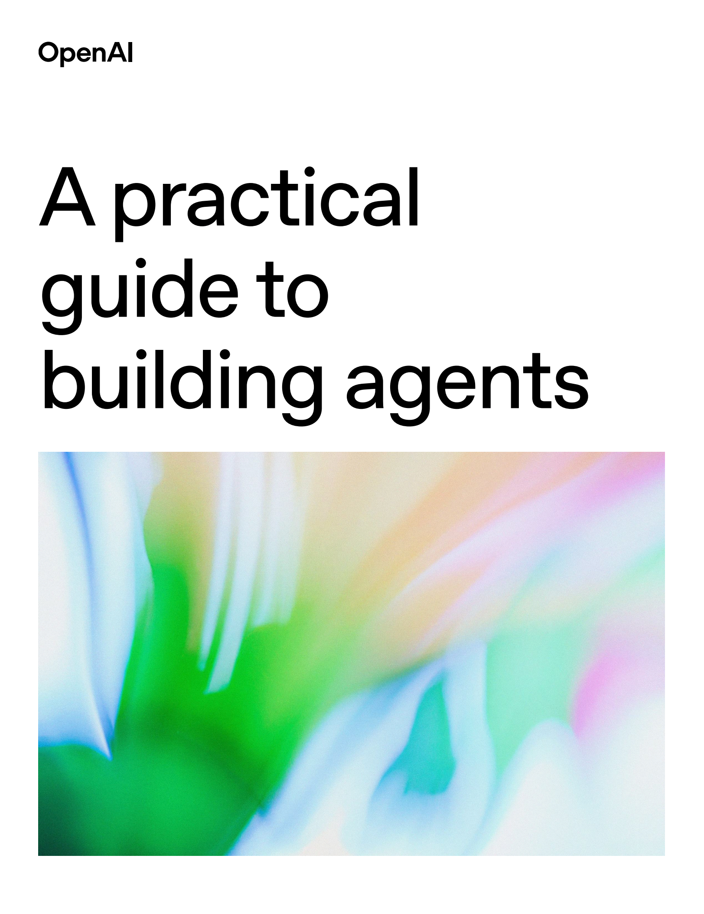

> 原文：[A practical guide to building agents](https://cdn.openai.com/business-guides-and-resources/a-practical-guide-to-building-agents.pdf)

AI 智能体（Agent）正引领一场软件范式的革命，它不再是简单的用户工具，而是能自主代表用户、接管并执行整个工作流的“代理人”。其核心是利用大型语言模型（LLM）作为推理引擎来驱动任务。本指南将提炼 OpenAI 的核心思想，为您提供一套构建、部署和管理 AI 智能体的实用策略。

## 第一章：何时需要构建 AI 智能体？

在投入开发前，首先要判断您的场景是否真的需要智能体。智能体并非万能，它主要用于解决传统基于规则的自动化难以胜任的“认知劳动”。如果您的业务面临以下挑战，那么构建智能体将是正确的选择：

1. 复杂的决策制定 (Complex Decision-Making): 当任务需要超越“if-then-else”规则的微妙判断时。
   
   - 场景示例： 复杂的客户退款审批。传统系统只能看“购买是否超30天”，而智能体能综合评估客户忠诚度、历史记录、问题性质等非结构化信息，做出更人性化的决策。

2. 难以维护的规则系统 (Difficult-to-Maintain Rules): 当业务逻辑依赖于一个庞大、脆弱且频繁变更的规则引擎时。
   
   - 场景示例： 供应商合规性审查。与其硬编码上百条随时可能过期的政策法规，不如让智能体直接将政策文档作为上下文，在每次审查时进行动态的理解和应用。

3. 非结构化数据处理 (Unstructured Data Processing): 当工作流的核心是理解和提取电子邮件、PDF、对话记录等非结构化数据时。
   
   - 场景示例： 保险理赔。智能体可以自动阅读事故报告、医疗记录和客户邮件，提取关键信息并完成初步的综合评估，极大提升效率。  

核心思想： 智能体的价值在于自动化“判断”与“解读”，而非简单的程序性任务。

## 第二章：智能体的三大核心支柱

一个设计精良的智能体由三大基本组件构成：模型 (Model)、工具 (Tools) 和 指令 (Instructions)。这种架构将“思考”、“行动”与“策略”分离，带来了极高的灵活性和可维护性。

### 2.1 模型 (大脑): 驱动推理的核心

模型（通常是 LLM）是智能体的决策中心。

- 选择策略：“从高到低” (Start Smart)
  - 第一步： 在原型阶段，务必使用当前最强大的模型（如 GPT-4o）来建立性能基准。这能让你验证工作流、工具和指令的有效性，排除“模型能力不足”这个干扰项。如果此时依然失败，问题就清晰地指向了工具或指令设计。
  - 第二步： 建立基准后，再尝试用更经济、更快速的模型替换部分或全部任务，并通过量化评估（Evals）来验证性能是否仍在可接受范围内，从而在性能、成本和延迟之间找到最佳平衡点。

### 2.2 工具 (双手): 与世界交互的桥梁

工具是智能体调用外部函数或 API 以获取信息或执行动作的途径。工具定义本身就是一项关键技能，其描述的清晰度直接决定了智能体调用的成功率。

| 工具类型                    | 描述                                         | 示例                                                  |
| --------------------------- | -------------------------------------------- | ----------------------------------------------------- |
| 数据检索 (Data Retrieval)   | （只读） 从外部获取信息，为决策提供上下文。  | query_database()、read_pdf()、search_knowledge_base() |
| 动作执行 (Action Execution) | （可写） 在外部系统执行操作，改变其状态。    | send_email()、update_crm_record()、execute_code()     |
| 编排 (Orchestration)        | 将另一个智能体封装成工具，用于委派复杂任务。 | triage_support_ticket(details) (调用一个分诊智能体)   |

### 2.3 指令 (行为准则): 定义目标的蓝图

指令是智能体的行动指南，是承载业务逻辑的核心。编写指令应被视为一项严肃的工程活动。

- 核心最佳实践：
  - 利用现有文档： 将公司已有的标准操作流程（SOPs）、政策手册直接改编为智能体的分步指令。
  - 明确与分解： 将宏大目标分解为具体、可执行的小步骤。明确告知智能体在何时使用何种工具。
  - 使用模板： 利用带有参数化变量（如 {{customer_name}}）的提示模板，动态生成个性化指令。
  - 处理边界情况： 在指令中明确定义异常情况（如用户未提供订单号）的处理逻辑。

核心思想： 采用“指令即代码” (Instructions as Code) 的理念，将指令纳入版本控制、进行代码审查并建立配套的评估测试，以确保其可靠性和可维护性。

## 第三章：架构设计：从单一到协作

首要原则：从简到繁，增量演进。 切勿一开始就设计复杂的终极系统。从最简单的单一智能体入手，在真实场景中验证，再根据需求逐步增加复杂性。这能有效控制智能体的“认知负荷”，避免其因工具或指令过多而产生混乱。

### 3.1 单一智能体系统 (Single-agent System)

这是最推荐的起点。一个 LLM 模型，配备一套专属的工具和指令，在一个“运行循环”（Run Loop）中持续工作，直到任务完成。它行为类似一个“有状态的微服务”，在生命周期内维护着对话历史和工具调用记录。

### 3.2 多智能体系统 (Multi-agent System)

当任务的复杂性超出单个智能体的承载能力时，应转向多智能体系统。这实现了更高层次的“关注点分离”。

- 主管模式 (Manager Pattern): 层级化协作
  
  - 结构： 一个“主管”智能体负责任务分解，并将子任务委派给多个专门的“下属”智能体（它们对主管而言就是工具）。主管负责收集结果并整合。
  - 类比： 项目经理协调不同专家（设计师、程序员）的工作。
  - 适用场景： 可被并行处理，或需要综合多种信息才能完成的任务。

- 去中心化模式 (Decentralized Pattern): 流水线式协作
  
  - 结构： 系统中没有中心主管，一群对等的专家智能体根据任务进展，将控制权和上下文“传递”给下一个最合适的智能体。
  - 类比： 工厂流水线或部门间的工作交接。
  - 适用场景： 线性的、由不同阶段专家序贯处理的流程。

核心思想： 编排模式的选择是业务流程的设计决策，它应该精确映射真实世界中的协作模式。

## 第四章：安全与可控性：构建信任的基石

一个不可信的智能体毫无价值。安全必须是贯穿始终的核心设计，而非事后补丁。

### 4.1 核心策略：分层防御 (Defense in Depth)

不要依赖单一的安全措施。应构建一个由多层、多样化护栏组成的纵深防御体系。即使一层失效，后续层面仍能捕获风险。这就像为智能体打造一个“免疫系统”。

### 4.2 关键护栏机制

| 护栏类型        | 目的                                           | 实现方法                                          |
| --------------- | ---------------------------------------------- | ------------------------------------------------- |
| 相关性分类器    | 确保交互不偏离主题，防止任务劫持。             | 使用独立的 LLM 分类器或关键词过滤。               |
| 安全分类器      | 拦截有害、不道德的内容。                       | 调用 OpenAI Moderation API 或自建安全模型。       |
| PII 过滤器      | 防止个人敏感信息（如电话、邮箱）泄露。         | 使用正则表达式（Regex）或专门的 NER 模型。        |
| 工具风险评估    | 对高风险工具（如“删除数据库”）的调用进行门控。 | 为工具附加风险等级，并触发相应审批流程。          |
| 输出验证        | 确保最终响应符合格式、品牌语调和合规要求。     | 使用 Pydantic 验证结构，或用另一个 LLM 评估语调。 |
| 审计 (Auditing) | 详细记录智能体的所有行为，用于事后分析。       | -                                                 |

### 4.3 人工监督与干预 (Human-in-the-Loop, HITL)
HITL 不是降级方案，而是建立信任、处理高风险和模糊场景的核心功能。它让智能体在初期扮演“超级助理”，将决策方案提交给人类审批。随着信任的建立，可以逐步提高其自主权。

- 何时触发人工介入？
    - 失败阈值： 当智能体连续多次犯错或陷入循环时。
    - 高风险操作： 默认需要人工批准的操作，如大额退款、删除生产数据。
    - 低置信度： 训练智能体识别自己的“不确定”状态，并主动请求帮助。
  
### 结论：迈向智能体驱动的未来
构建生产级 AI 智能体是一项系统工程，它需要：

- 坚实的技术基石： 模型、工具、指令的三位一体。
- 明智的演进路径： 从单一到多智能体的渐进式架构。
- 可靠的保障体系： 分层防御的安全护栏与清晰的人工干预机制。

未来，行业的焦点将从孤立的智能体，转向由众多专业智能体协同工作的“智能体生态系统”，共同优化整个业务职能。本指南阐述的原则，正是构建这一宏伟蓝图所必需的坚实基础。
