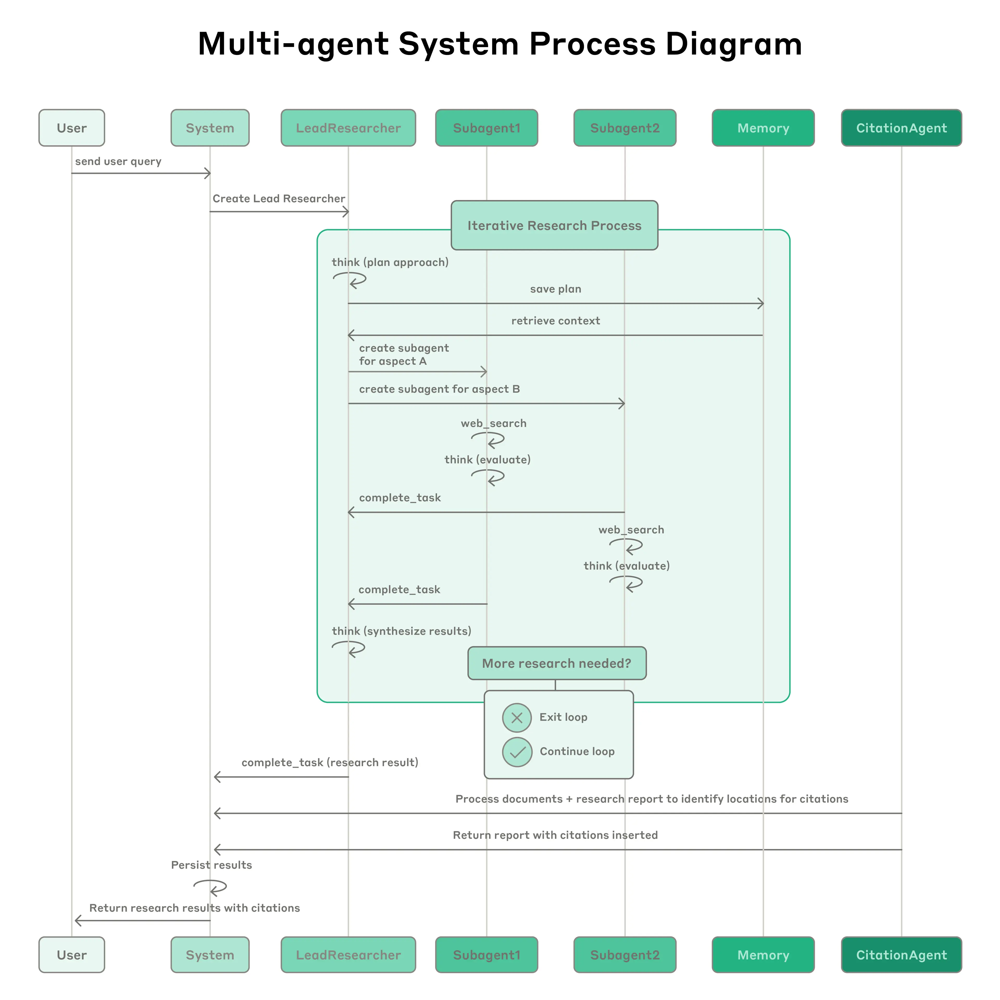
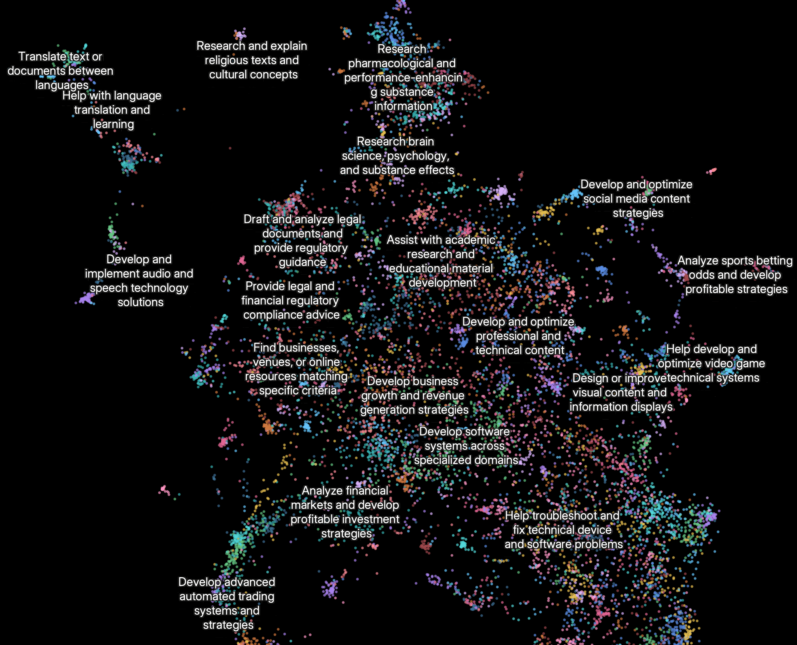

> 原文：[How we built our multi-agent research system](https://www.anthropic.com/engineering/built-multi-agent-research-system)
## 我们如何构建我们的多智能体研究系统
我们的研究（Research）功能使用多个 Claude 代理来更有效地探索复杂主题。我们在此分享构建该系统时遇到的工程挑战以及我们学到的经验教C训。

在许多方面，研究都是大型语言模型（LLM）的理想任务。它奖励那些能够吸收和综合大量文本以产生新颖见解的模型。我们的许多客户已经在使用 Claude 来帮助他们进行研究，例如法律先例分析、评估投资组合以及跟上快速发展的科学领域。

为了更好地支持这些复杂的、开放式的研究任务，我们构建了“研究”功能（Research feature）。与传统的聊天体验不同，它在后台使用多个专门的 AI 代理。这个多智能体系统使 Claude 能够探索比单个模型可以处理的更广泛的信息，从而为我们的用户带来更深入、更全面的见解。

在本文中，我们将探讨我们构建和扩展多智能体系统的经验和教训，包括我们为解决可靠性、延迟和评估方面的挑战而开发的解决方案。

## 什么是多智能体系统？
多智能体系统由多个代理（在循环中自主使用工具的 LLM）协同工作。我们的研究功能涉及一个代理，它根据用户查询规划研究过程，然后使用工具创建并行代理，同时搜索信息。

本质上，搜索就是压缩：从庞大的语料库中提炼出见解。早期的搜索技术，如 TF-IDF 和 BM25，通过查找与查询匹配的关键词来压缩文档。静态检索增强生成（RAG）通过根据查询相似性检索预定块来压缩知识库，然后将其注入 LLM 的上下文窗口。

然而，研究需要动态探索。它是一个开放式过程，其中策略会根据新发现不断调整。研究人员在寻找答案时会追寻新兴的线索，而不是遵循固定的路径。

对于需要探索广泛主题的查询，单代理系统会遇到困难。它们的顺序处理和有限的上下文窗口成为瓶颈。例如，识别 IT 行业标准普尔 500 强公司的董事会成员，对于一个模型来说，搜索空间太大了。

多智能体系统通过将任务分解为可以并行探索的子任务来克服这些限制。这种架构支持我们所称的“广度优先”研究，即多个代理同时追寻多个独立的方向。

在我们的内部评估中，我们发现多智能体研究系统在需要同时追求多个独立方向的广度优先查询方面表现尤为出色。我们发现，在我们的内部研究评估中，一个以 Claude 3 Opus 作为领导代理、Claude 3 Sonnet 作为子代理的多智能体系统的表现比单代理的 Claude 3 Opus 高出 90.2%。

然而，多智能体系统并非万能。对于本质上顺序性、几乎没有并行化空间且需要代理之间实时协作的任务（例如编码项目），它们的效果较差。

## 研究功能的架构概览
我们的研究系统采用多智能体架构，具有协调器-工作者（orchestrator-worker）模式，其中一个领导代理协调流程，同时委托给并行操作的专门子代理。

该过程始于一个领导代理，它接收用户查询并将其分解为子任务。然后，它启动多个并行运行的子代理。每个子代理负责一个特定的子任务——例如，一个代理可能搜索最新的市场数据，而另一个代理则深入研究技术文档。子代理通过工具调用（tool use）API 与外部世界（如网络搜索或特定数据库）进行交互。

子代理完成后，它们将结果返回给领导代理。领导代理审查这些部分结果，决定是否需要进一步的研究，或综合信息以形成最终答案。

我们发现多智能体系统在涉及大量并行化、信息量超过单个上下文窗口以及与众多复杂工具接口的有价值任务中表现出色。当任务的价值足够高以支付增加的性能成本时，它们是经济上可行的。

## 为代理编写提示（Prompting）的经验教训
由于每个代理都由提示（prompt）引导，提示工程是我们改进这些行为的主要手段。我们发现，改变提示中的一两个词就可能产生级联效应。

以下是我们学到的一些为代理编写提示的原则：

- 像你的代理一样思考。 为了迭代提示，你必须了解其效果。为了帮助我们做到这一点，我们使用控制台（Console）和系统中的确切提示和工具构建了模拟，然后逐步观察代理的工作。这立即揭示了失败模式：代理在已经有足够结果时仍继续工作，使用过于冗长的搜索查询，或选择不正确的工具。有效的提示依赖于开发一个准确的代理心智模型，这可以使最有影响力的改变变得显而易见。
- 教会协调器如何授权。 在我们的系统中，领导代理将查询分解为子任务并向子代理描述它们。每个子代理都需要一个目标、一个输出格式、关于使用哪些工具和来源的指导以及明确的任务边界。没有详细的任务描述，代理会重复工作、留下空白或找不到必要的信息。
根据查询复杂性扩展投入。 代理很难判断不同任务的适当投入，所以我们在提示中嵌入了扩展规则。简单的事实查找只需要1个代理进行3-10次工具调用，直接比较可能需要2-4个子代理，每个代理进行10-15次调用，而复杂的研究可能使用超过10个具有明确分工的子代理。
- 工具设计和选择至关重要。 我们发现，拥有少量、可靠且经过充分记录的工具，其性能优于拥有大量、不可靠的工具。我们甚至创建了一个工具测试代理——当给定一个有缺陷的工具时，它会尝试使用该工具，然后重写工具描述以避免失败。
- 让代理自我改进。 我们正在试验让代理在工作中学习和适应的方法，以提高其性能。例如，我们正在研究让代理根据其互动的历史记录动态调整其工具使用策略的方法。
- 从宽泛开始，然后收窄。 我们发现，有效的策略是首先进行广泛的、探索性的搜索，以确定关键主题和来源，然后创建更集中的子代理，深入研究特定的感兴趣领域。
- 引导思考过程。 我们在提示中使用元认知提示（metacognitive prompting）来鼓励代理在行动之前“停下来思考”。例如，我们可能会提示代理，“在承诺一个冗长的研究路径之前，请花点时间回顾一下到目前为止的发现，并考虑一下替代方法。”
- 并行的工具调用可以改变速度和性能。 我们在系统中大量使用并行工具调用，允许单个代理同时与多个工具交互。这大大减少了延迟并提高了研究过程的效率。
## 在生产环境中构建多智能体系统
从原型到生产系统的飞跃引入了新的挑战。以下是我们如何应对其中一些挑战的：

- 复合性错误。 代理系统中的错误会复合。一个步骤的失败可能导致代理探索完全不同的轨迹。我们通过构建从中断处恢复的能力来解决这个问题——如果代理失败，它可以从上次成功状态重新启动，而不是从头开始。
- 评估。 研究输出很难以编程方式评估，因为它们是自由格式的文本，很少有单一的正确答案。我们使用一个 LLM 评判员，根据一个评分标准来评估每个输出：事实准确性、引文准确性、完整性、来源质量和工具效率。
- 调试。 追踪代理行为可能很困难。添加完整的生产追踪让我们能够诊断代理为什么会失败，并系统地修复问题。除了标准的可观察性，我们还监控代理决策模式和交互结构——所有这些都在不监控单个对话内容的情况下进行，以维护用户隐私。
- 部署。 代理系统是状态性很强的提示、工具和执行逻辑的网络，几乎持续运行。这意味着每当我们部署更新时，代理可能处于其执行周期的任何位置。为了管理这一点，我们使用了“彩虹部署”（rainbow deployments），即我们一次部署一个完整的系统堆栈（例如，“蓝色”或“绿色”），并逐渐将流量转移到新版本。
- 同步执行的限制。 目前，我们的系统同步运行，这意味着用户在研究完成之前会看到一个加载旋转器。对于快速查询，这是有效的，但对于需要广泛研究的更复杂的任务，这可能会导致延迟过长。我们正在探索异步执行，其中代理可以在后台工作，并在准备好后通知用户。
## 未来方向
我们对多智能体系统在未来实现更复杂形式的研究的潜力感到兴奋。我们正在探索的一些领域包括：

- 主动和个性化的研究：我们设想代理可以根据用户的历史和偏好主动进行研究，在他们提出要求之前就预测到他们的需求。
- 科学发现：我们正在探索使用多智能体系统加速科学研究的方法，例如通过自动进行文献综述、假设生成和实验设计。
- 通过辩论提高研究的稳健性：我们正在尝试让代理扮演不同的角色，例如“怀疑论者”或“辩护者”，以参与结构化的辩论。我们的初步研究表明，这种对抗性过程可以揭示单一代理可能会错过的偏见和假设。  

构建我们的多智能体研究系统是一次充满启发和挑战的旅程。我们为我们所取得的进展感到自豪，并对未来的可能性感到兴奋。我们希望分享我们的经验教训可以帮助其他构建者应对他们自己项目中的挑战和机遇。
