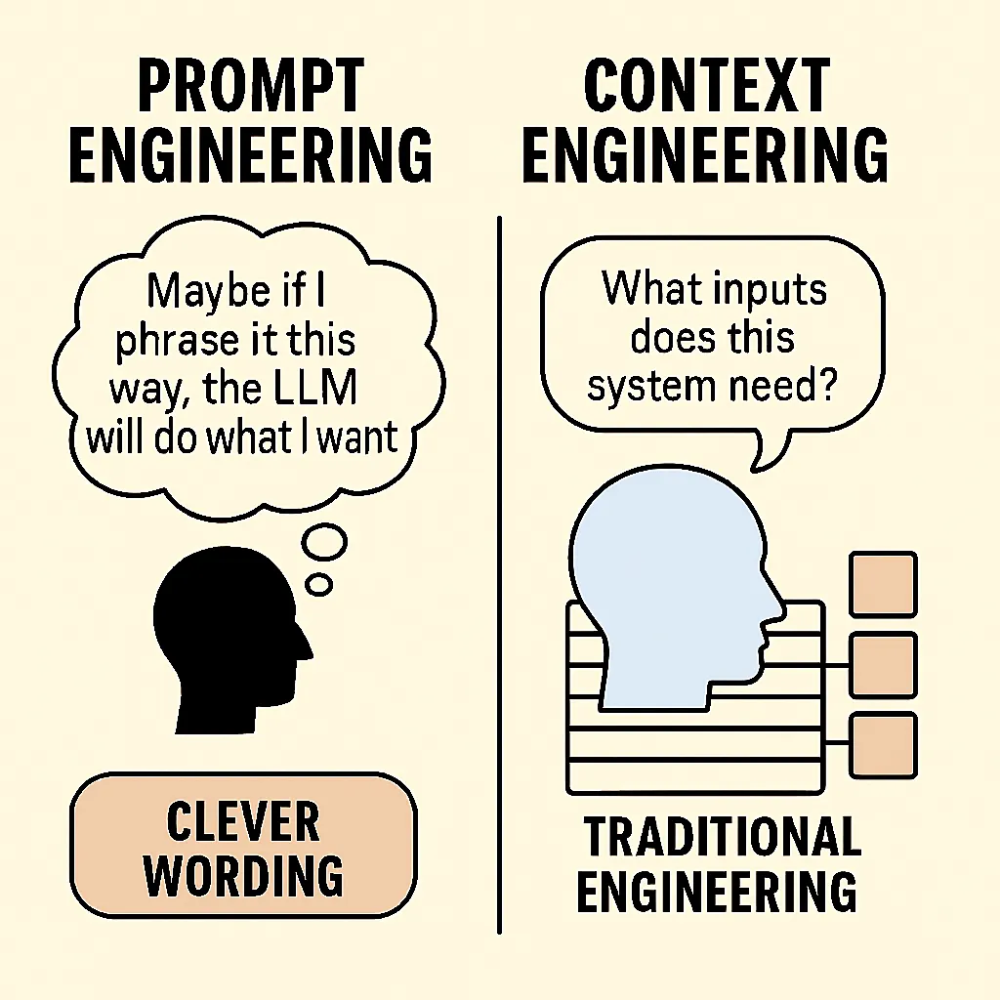
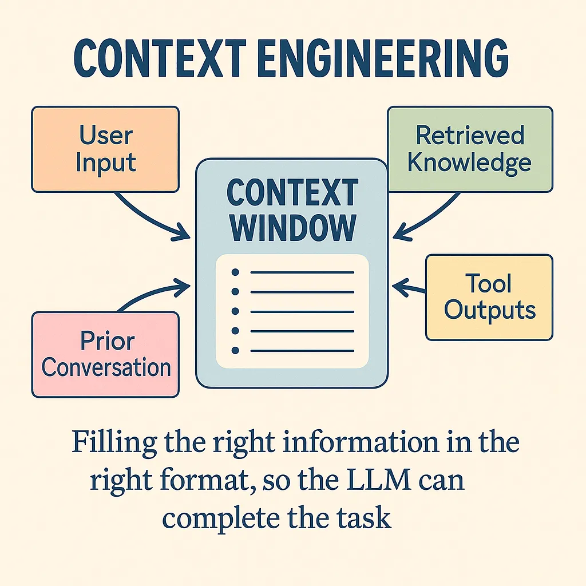
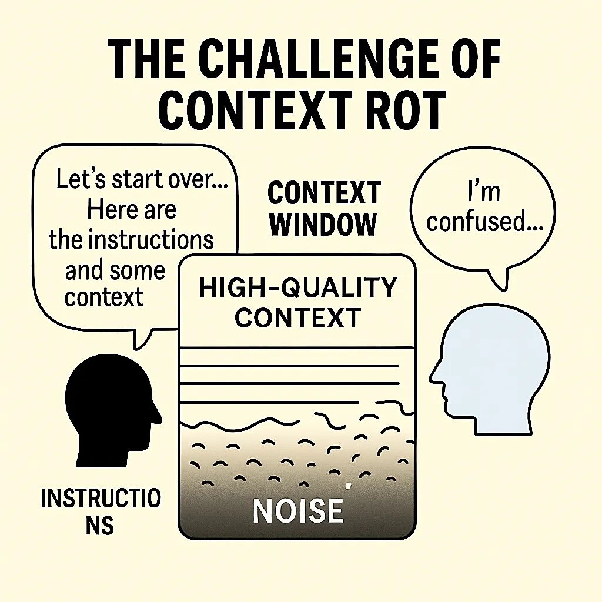
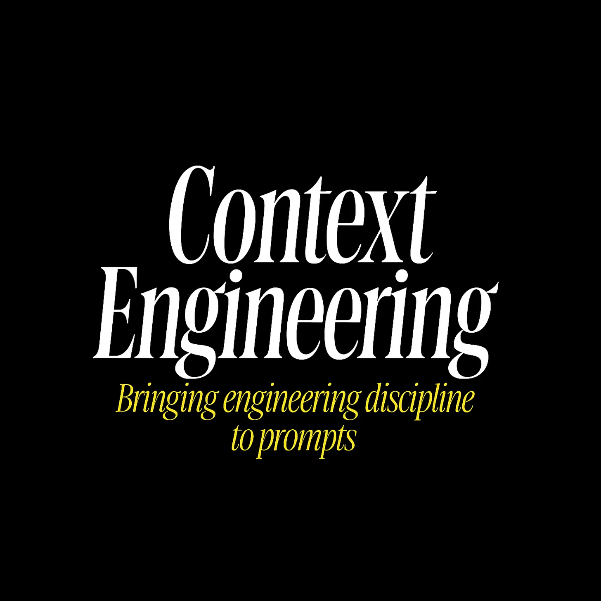

一篇关于 AI Prompt 信息架构的实用指南

> 原文：[Context Engineering: Bringing Engineering Discipline to Prompts](https://addyo.substack.com/p/context-engineering-bringing-engineering)

TL;DR: “Context Engineering”（上下文工程）是指为 AI（如 LLM）提供成功完成任务所需的所有信息和工具——而不仅仅是一段措辞巧妙的 prompt。它是 “Prompt Engineering” 的演进，体现了一种更宏大、更系统化的方法。

## Context Engineering 小贴士：

要从 AI 获得最佳结果，你需要提供清晰而具体的上下文。AI 输出的质量直接取决于你输入的质量。

如何改进你的 AI prompt

- **精确**： 模糊的请求导致模糊的回答。你描述得越具体，结果就越好。

- **提供相关代码**： 分享与你请求核心相关的特定文件、文件夹或代码片段。

- **附上设计文档**： 粘贴或附上相关设计文档的章节，让 AI 了解全局。

- **分享完整的错误日志**： 在调试时，务必提供完整的错误信息和任何相关的日志或堆栈跟踪（stack traces）。

- **展示数据库结构（schema）**： 在处理数据库时，一张 schema 截图能帮助 AI 生成准确的数据交互代码。

- **利用 PR 反馈**： Pull Request 中的评论是富含上下文的优质 prompt 素材。

- **给出示例**： 展示一个你期望的最终输出样例。

- **声明约束**： 清晰地列出任何限制，比如必须使用的库、需要遵循的模式或应避免的做法。

## 从 “Prompt Engineering” 到 “Context Engineering”

Prompt Engineering 曾是关于如何巧妙地提问；而 Context Engineering 则是关于构建一个完整的信息环境，以便 AI 能够可靠地解决问题。

“Prompt Engineering” 曾是一个时髦词，大意是指通过调整输入措辞来获得更好输出的技巧。它教会我们用巧妙的“一句流”散文来进行编程。但在 AI 社区之外，许多人把 Prompt Engineering 简单理解为在聊天机器人里输入花哨的请求。这个词从未能完全传达出有效使用 LLM 所需的真正复杂性。

随着应用日益复杂，仅关注单个 prompt 的局限性变得显而易见。一篇分析文章风趣地说道：Prompt Engineering 的出现，就是为了给 Context Engineering 的起飞铺路。 换句话说，一个机智的一次性 prompt 可能会在演示中让我们惊艳，但要构建可靠的、工业级强度的 LLM 系统，则需要更全面的东西。

正是这种认识，让我们的领域正在凝聚共识，认为 “Context Engineering” 是一个更好的术语，用以描述从 AI 获取卓越成果的这门手艺。Context Engineering 意味着构建 LLM 所能看到的整个上下文窗口（context window）——不仅仅是一条简短的指令，而是任务所需的所有相关背景信息、示例和指导。

这个说法在 2025 年中由 Shopify 的 CEO Tobi Lütke 和 AI 领袖 Andrej Karpathy 等开发者推广开来。

> Tobi 写道：“我真的很喜欢‘Context Engineering’这个词，而不是 Prompt Engineering。它更好地描述了核心技能：为任务提供所有上下文，使其能被 LLM 合理地解决的艺术。” Karpathy 对此表示强烈赞同，并指出，人们通常将 prompt 与简短指令联系在一起，但在每一个严肃的 LLM 应用中，Context Engineering 都是一门为每一步精确填充上下文窗口的精妙艺术和科学。

换句话说，现实世界中的 LLM 应用并非靠运气或一次性 prompt 成功，而是通过在模型查询周围精心组装上下文来取得成功的。

术语的转变反映了方法的演进。如果说 Prompt Engineering 是想出一个神奇的句子，那么 Context Engineering 就是为 AI **编写完整的剧本**。这是一种结构性的转变：Prompt Engineering 在你制作好一个 prompt 后就结束了，而 Context Engineering 则始于设计一个能有组织地引入记忆、知识、工具和数据的完整系统。

正如 Karpathy 所解释的，要做好这一点，涉及方方面面，从清晰的任务指令和解释，到提供 few-shot 示例、检索到的事实（RAG）、可能的多模态数据、相关工具、状态历史，以及将所有这些小心翼翼地压缩进有限的窗口中。**上下文太少（或类型不对），模型将缺乏信息，无法达到最佳性能；无关上下文太多，则会浪费 token，甚至可能降低性能。 找到这个最佳平衡点并非易事。**难怪 Karpathy 称之为一门科学与艺术的结合。

“**Context Engineering**” 这个词之所以流行，是因为它直观地捕捉到了我们构建 LLM 解决方案时的实际工作。“Prompt” 听起来像一个简短的查询；而 “Context” 则暗示了我们为 AI 准备的更丰富的信息状态。

撇开语义不谈，为什么这个转变如此重要？因为它标志着我们 AI 开发心态的成熟。我们已经认识到，生产环境中的生成式 AI 不像念一句魔法咒语，而更像是为 AI 设计一整个环境。一个一次性的 prompt 可能会做出很酷的演示，但要获得稳健的解决方案，你需要在每一步都控制模型“知道”和“看到”什么。这通常意味着检索相关文档、总结历史、注入结构化数据或提供工具——尽一切可能让模型不必在黑暗中猜测。其结果是，我们不再将 prompt 视为希望 AI 能理解的一次性指令，而是开始用**上下文管道（context pipelines）**的思维方式来思考：所有能让 AI 走向成功的各种信息和交互片段。

为了说明这一点，可以思考一下视角的差异。Prompt Engineering 常常是一种措辞上的巧思（“也许我换种说法，LLM 就会照我说的做”）。相比之下，Context Engineering 更像是传统的工程学：这个系统需要哪些输入（数据、示例、状态）？我如何获取并提供这些输入？以什么格式？在什么时候？ 我们基本上已经从从单个 prompt 中榨取性能，转向设计由 LLM 驱动的系统。

## 到底什么是 Context Engineering？

Context Engineering 意味着在运行时动态地给予 AI 成功所需的一切——指令、数据、示例、工具和历史记录——所有这些都被打包到模型的输入上下文中。

一个有用的心智模型（由 Andrej Karpathy 等人提出）是，将 LLM 想象成一个 CPU，而它的上下文窗口（它一次能看到的文本输入）则像是 RAM 或工作内存。作为工程师，你的工作类似于一个操作系统：将恰到好处的代码和数据加载到那个工作内存中，以完成特定任务。

*在实践中，这些上下文可以来自多种来源：用户的查询、系统指令、从数据库或文档中检索到的知识、其他工具的输出，以及先前交互的摘要。Context Engineering 就是将所有这些部分编排成模型最终看到的 prompt 的艺术。它不是一个静态的 prompt，而是在运行时对信息的动态组装。*

让我们来分解一下这具体涉及什么：

- **它是一个系统，而非一次性的 prompt。** 在一个精心设计的系统中，LLM 最终看到的 prompt 可能包含多个组件：例如，由开发者编写的角色指令，加上最新的用户查询，再加上动态获取的相关数据，或许还有几个期望输出格式的示例。所有这些都是通过程序化方式编织在一起的。例如，想象一个编码助手 AI，它收到了查询“如何修复这个认证 bug？”。它背后的系统可能会自动在你的代码库中搜索相关代码，检索出相关的文件片段，然后构建一个像这样的 prompt：“你是一个专家级编程助手。用户正面临一个认证 bug。这里是相关的代码片段：[代码]。用户的错误信息是：[日志]。请提供一个修复方案。” 注意这个最终的 prompt 是如何由多个部分构建起来的。**Context Engineering 就是决定引入哪些部分以及如何将它们组合在一起的逻辑。** 这类似于编写一个为另一个函数调用准备参数的函数——只不过这里的“参数”是上下文的片段，而那个“函数”是 LLM 的调用。

- **它是动态且针对具体情况的。** 与单个硬编码的 prompt 不同，上下文的组装是根据每个请求发生的。系统可能会根据查询或对话状态包含不同的信息。如果是一个多轮对话，你可能会包含一个对话摘要，而不是完整的对话记录，以节省空间（和保持理智）。如果用户的问题引用了某个文档（“设计规范里关于 X 是怎么说的？”），系统可能会从 wiki 中获取该规范并包含相关摘录。简而言至，Context Engineering 的逻辑会响应当前的状态——就像程序的行为取决于输入一样。这种动态性至关重要。你不会为翻译的每一句话都给翻译模型完全相同的 prompt；你会每次都给它新的句子。同样，在一个 AI Agent 中，随着状态的演变，你会不断更新你提供的上下文。

- **它融合了多种类型的内容。** LangChain 将 Context Engineering 描述为一个涵盖至少三种上下文维度的总称：(1) **指令性上下文（Instructional context）**——我们提供的 prompt 或指导（包括系统角色指令和 few-shot 示例），(2) **知识性上下文（Knowledge context）**——我们提供的领域信息或事实，通常通过从外部来源检索获得，以及 (3) **工具性上下文（Tools context）**——通过工具或 API 调用从模型环境中获得的信息（例如，来自网络搜索、数据库查询或代码执行的结果）。一个稳健的 LLM 应用通常需要所有这三种：关于任务的清晰指令、植入的相关知识，以及模型可能需要使用工具并将其结果整合回思考过程的能力。Context Engineering 就是管理所有这些信息流并将它们连贯地融合在一起的学科。

- **格式和清晰度至关重要。** 问题不仅在于你在上下文中包含了什么，还在于你如何呈现它。与 AI 模型沟通与和人沟通有惊人的相似之处：如果你扔给它一大堆非结构化的文本，模型可能会感到困惑或抓不住重点，而一个组织良好的输入则会引导它。Context Engineering 的一部分工作是弄清楚如何压缩和结构化信息，以便模型能抓住重点。这可能意味着总结长文本、使用项目符号或标题来突出关键事实，或者甚至将数据格式化为 JSON 或伪代码，如果这有助于模型解析的话。例如，如果你检索了一段文档，你可以在前面加上“相关文档：”并将其放在引号中，这样模型就知道这是参考材料。如果你有一个错误日志，你可能只显示最后 5 行，而不是 100 行的堆栈跟踪。有效的 Context Engineering 通常涉及创造性的信息设计——让输入对 LLM 尽可能易于消化。

最重要的是，Context Engineering 是为了**让 AI 为成功做好准备。**

请记住，LLM 功能强大但不是神算子——它只能根据其输入内容加上训练时学到的知识来作答。如果它失败或产生幻觉，根本原因往往是我们没有给它正确的上下文，或者我们给了它结构糟糕的上下文。当一个 LLM “Agent” 行为不端时，通常是**“适当的上下文、指令和工具没有被传达给模型”**。垃圾进，垃圾出。反之，如果你确实提供了所有相关信息和清晰的指导，模型的性能会显著提高。

**提供高质量上下文的实用技巧**  
那么，具体来说，我们如何确保我们为 AI 提供了它所需的一切呢？以下是我在构建 AI 编程助手和其他 LLM 应用时发现的一些实用技巧：

- **包含相关的源代码和数据。** 如果你要求 AI 处理代码，请提供相关的代码文件或片段。不要假设模型会从记忆中回忆起某个函数——给它看实际的代码。同样，对于问答任务，请包含相关的事实或文档（通过检索）。低上下文保证了低质量的输出。 模型无法回答你没有给它的东西。

- 指**令要精确。** 清楚地说明你想要什么。如果你需要特定格式的答案（JSON、特定风格等），请明确指出。如果 AI 在编写代码，请指明约束条件，如使用（或避免）哪些库或模式。请求中的模糊不清会导致答案漫无目的。

- **提供期望输出的示例。** Few-shot 示例非常强大。如果你想让一个函数以某种特定风格被注释，就在 prompt 中展示一两个正确注释的函数示例。对输出进行建模有助于 LLM 准确理解你的要求。

- **利用外部知识。** 如果任务需要超出模型训练范围的领域知识（例如，公司特定的细节、API 规范），请检索该信息并将其放入上下文中。例如，附上设计文档的相关部分或 API 文档的片段。当 LLM 能够引用所提供文本中的事实，而不是从记忆中回忆时，它们会准确得多。

- 在**调试时包含错误信息和日志。** 如果要求 AI 修复一个 bug，请向它展示完整的错误跟踪或日志片段。这些通常包含解决问题的关键线索。同样，如果问为什么测试失败，请包含任何测试输出。

- **（聪明地）维护对话历史。** 在聊天场景中，反馈对话至今的重要部分。通常你不需要完整的历史记录——一个关键点或决定的简明摘要就足够了，并且可以节省 token 空间。这让模型了解已经讨论过的内容。

- **不要回避元数据和结构。** 有时告诉模型你为什么给它一段上下文会有帮助。例如：“这是用户的查询。” 或 “这里是相关的数据库 schema：”作为前缀标签。像“用户输入：… / 助手回应：…”这样的简单段落标题有助于模型解析多部分 prompt。使用格式化（markdown、项目符号列表、编号步骤）来使 prompt 在逻辑上清晰。

记住黄金法则：**LLM 很强大，但它们不会读心术。** 输出的质量与你提供的上下文的质量和相关性成正比。上下文太少（或缺失部分），AI 就会用猜测来填补空白（通常是错误的）。不相关或嘈杂的上下文也同样糟糕，会把模型引向错误的方向。因此，我们作为 Context Engineer 的工作就是精确地喂给模型它所需要的，而不是它不需要的。

## 回应质疑者

让我们直接面对批评。许多经验丰富的开发者认为“Context Engineering”要么是 Prompt Engineering 的重新包装，要么更糟，是伪科学的流行词创造。这些担忧并非空穴来风。传统的 Prompt Engineering 专注于你给 LLM 的指令。而 Context Engineering 则涵盖了整个信息生态系统：动态数据检索、内存管理、工具编排以及多轮交互中的状态维护。当前很多 AI 工作确实缺乏我们期望从工程学科中看到的严谨性。有太多的试错，太少的度量，以及不足的系统化方法论。说实话：即使有完美的 Context Engineering，LLM 仍然会产生幻觉、犯逻辑错误，并在复杂推理上失败。Context Engineering 不是银弹——它是在当前限制下的损害控制和优化。

## 有效上下文的艺术与科学

优秀的 Context Engineering 能达到一种平衡——包含模型真正需要的一切，但避免可能分散其注意力（并增加成本）的不相关或过多的细节。

正如 Karpathy 所描述的，Context Engineering 是科学与艺术的精妙结合。

“科学”部分涉及遵循某些原则和技术来系统地提高性能。例如：如果你在做代码生成，包含相关代码和错误信息几乎是科学常识；如果你在做问答，检索支持文档并提供给模型是合乎逻辑的。我们已经有一些成熟的方法，如 few-shot prompting、检索增强生成（RAG）和思维链（chain-of-thought）prompting，我们知道（通过研究和试验）这些方法可以提升结果。尊重模型的约束也是一门科学——每个模型都有上下文长度限制，过度填充这个窗口不仅会增加延迟/成本，如果重要部分被噪音淹没，还可能降低质量。

> Karpathy 总结得很好：“太少或形式不对，LLM 就没有最佳性能所需的上下文。太多或太不相关，LLM 的成本可能会上升，性能可能会下降。”

所以，科学在于选择、修剪和优化格式化上下文的技术。例如，使用 embeddings 来找到最相关的文档以包含进来（这样你就不会插入不相关的文本），或者将长历史压缩成摘要。研究人员甚至对长上下文的失败模式进行了分类——比如上下文污染（context poisoning，指上下文中早期的幻觉导致进一步的错误）或上下文分心（context distraction，指过多的无关细节导致模型失去焦点）。了解这些陷阱后，一个好的工程师会仔细策划上下文。

然后是“艺术”的一面——源于经验的直觉和创造力。

这是关于理解 LLM 的怪癖和微妙行为。把它想象成一个经验丰富的程序员，他“就是知道”如何构建代码以提高可读性：一个经验丰富的 Context Engineer 会对如何为特定模型构建 prompt 产生一种感觉。例如，你可能会感觉到某个模型在你先概述解决方案方法再深入细节时表现得更好，所以你在 prompt 中加入一个初始步骤，如“让我们一步一步地思考……”。或者你注意到模型经常误解你领域中的一个特定术语，所以你在上下文中预先澄清它。这些东西手册里没有——你是通过观察模型输出和迭代来学习的。这就是旧意义上的 prompt 制作仍然重要的地方，但现在它服务于更大的上下文。 这类似于软件设计模式：理解常见的解决方案是科学，但知道何时以及如何应用它们是艺术。

让我们探讨一些 Context Engineer 用来制作有效上下文的常见策略和模式：

- **检索相关知识：** 最强大的技术之一是检索增强生成（RAG）。如果模型需要其训练记忆中不保证存在的事实或领域特定数据，让你的系统获取该信息并将其包含进来。例如，如果构建一个文档助手，你可能会对你的文档进行向量搜索，并在提问前将最匹配的段落插入到 prompt 中。这样，模型的答案将基于你提供的真实数据，而不是其有时过时的内部知识。这里的关键技能包括设计好的搜索查询或 embedding 空间以获取正确的片段，并清晰地格式化插入的文本（带引用或引号），以便模型知道要使用它。当 LLM “幻觉”出事实时，通常是因为我们未能提供真实的事实——检索是对此的解药。

- **Few-shot 示例和角色指令：** 这可以追溯到经典的 Prompt Engineering。如果你希望模型以特定的风格或格式输出内容，给它看例子。例如，要获得结构化的 JSON 输出，你可以在 prompt 中包含几个 JSON 格式的输入和输出示例，然后再要求一个新的。Few-shot 上下文通过示例有效地教导模型。同样，设置一个系统角色或人设可以引导语气和行为（“你是一个帮助用户的专家 Python 开发者……”）。这些技术是基本功，因为它们有效：它们使模型偏向于你想要的模式。在 Context Engineering 的思维模式中，prompt 的措辞和示例只是上下文的一部分，但它们仍然至关重要。实际上，你可以说 Prompt Engineering（制作指令和示例）现在是 Context Engineering 的一个子集——它是工具箱中的一个工具。我们仍然非常关心措辞和示范性示例，但我们还在它们周围做所有这些其他事情。

- **管理状态和记忆：** 许多应用涉及多轮交互或长时间会话。上下文窗口不是无限的，因此 Context Engineering 的一个主要部分是决定如何处理对话历史或中间结果。一种常见的技术是摘要压缩——每隔几次交互后，对其进行总结，并使用摘要而不是全文进行后续操作。例如，Anthropic 的 Claude 助手在对话变长时会自动这样做，以避免上下文溢出（你会看到它生成一个“[先前讨论的摘要]”来浓缩早期的回合）。另一种策略是将重要事实明确写入外部存储（文件、数据库等），然后在需要时稍后检索它们，而不是在每个 prompt 中都携带它们。这就像一个外部记忆。一些先进的 Agent 框架甚至让 LLM 生成“给自己的笔记”，这些笔记被存储起来，可以在未来的步骤中被回忆起来。这里的艺术在于弄清楚保留什么、何时总结，以及如何在正确的时刻重新浮现过去的信息。做得好，它能让 AI 在非常长的任务中保持连贯性——这是纯粹的 prompting 难以做到的。

- **工具使用和环境上下文：** 现代 AI Agent 可以使用工具（例如，调用 API、运行代码、浏览网页）作为其操作的一部分。当它们这样做时，每个工具的输出都成为下一次模型调用的新上下文。在这种场景下，Context Engineering 意味着指导模型何时以及如何使用工具，然后将结果反馈回来。例如，一个 Agent 可能有一条规则：“如果用户问一个数学问题，调用计算器工具。” 使用后，结果（比如 42）被插入到 prompt 中：“工具输出：42。” 这需要清晰地格式化工具输出，并可能添加一个后续指令，如“根据这个结果，现在回答用户的问题。” 许多 Agent 框架（如 LangChain 等）的工作本质上是围绕工具使用的 Context Engineering——给模型一个可用工具的列表、调用它们的语法指南，以及如何整合结果的模板。关键在于，你，作为工程师，编排了模型与外部世界之间的这种对话。

- **信息格式化和打包：** 我们已经触及了这一点，但它值得强调。通常你拥有的信息比能完全容纳或有用的要多。所以你压缩或格式化它。如果你的模型在编写代码，而你有一个庞大的代码库，你可能只包含函数签名或文档字符串，而不是整个文件，来给它上下文。如果用户查询冗长，你可能会在最后突出主要问题以集中模型的注意力。使用标题、代码块、表格——任何最能传达数据的结构。例如，与其说：“用户数据：[庞大的 JSON]……现在回答问题。” 你可以提取所需的几个字段并呈现：“用户名：X，账户创建时间：Y，最后登录时间：Z。” 这既更容易让模型解析，也使用更少的 token。简而言之，像 UX 设计师一样思考，但你的“用户”是 LLM——为它的消费来设计 prompt。

这些技术的影响是巨大的。当你看到一个令人印象深刻的 LLM 演示解决一个复杂的任务时（比如说，调试代码或规划一个多步骤过程），你可以打赌背后不仅仅是一个巧妙的 prompt。有一个上下文组装的管道在支撑它。

例如，一个 AI 结对程序员可能会实现一个这样的工作流：

1. 在代码库中搜索相关代码。
2. 将这些代码片段与用户的请求一起包含在 prompt 中。
3. 如果模型提出了一个修复方案，在后台运行测试。
4. 如果测试失败，将失败的输出反馈到 prompt 中，让模型改进其解决方案。
5. 循环直到测试通过。

每一步都有精心设计的上下文：搜索结果、测试输出等，都以受控的方式被喂给模型。这与“直接让 LLM 修复我的 bug”然后听天由命的做法相去甚远。

## “上下文腐化”的挑战

随着我们越来越擅长组装丰富的上下文，我们遇到了一个新问题：随着时间的推移，上下文实际上会自我污染。这种现象被 Hacker News 上的开发者 Workaccount2 恰如其分地称为**“上下文腐化”（context rot），它描述了随着对话变长，累积了干扰、死胡同和低质量信息，上下文质量是如何下降的**。

这种模式令人沮丧地普遍存在：你用一个精心制作的上下文和清晰的指令开始一个会话。AI 最初表现出色。但随着对话的继续——尤其是在有错误的开始、调试尝试或探索性的兔子洞时——上下文窗口被越来越嘈杂的信息填满。模型的响应逐渐变得不那么准确、更加混乱，或者开始产生幻觉。

为什么会发生这种情况？上下文窗口不仅仅是存储——它们是模型的工作记忆。当那个记忆被失败的尝试、矛盾的信息或离题的讨论弄得乱七八糟时，就像试图在一张堆满旧草稿和不相关文件的桌子上工作。模型难以识别什么是当前相关的，什么是历史噪音。对话中早期的错误会累积，形成一个反馈循环，模型引用自己糟糕的输出，并进一步偏离轨道。

这在迭代性工作流中尤其成问题——而这正是 Context Engineering 大放异彩的那种复杂任务。调试会话、代码重构、文档编辑或研究项目自然会涉及错误的开始和路线修正。但每一次失败的尝试都会在上下文中留下痕迹，干扰后续的推理。

管理上下文腐化的实用策略包括：

- **上下文修剪和刷新：** Workaccount2 的解决方案是“我通过定期制作实例的摘要来解决它，然后用新的上下文启动一个新实例，并喂入前一个实例的摘要。” 这种方法保留了必要的状态，同时丢弃了噪音。你基本上是在为你的上下文做垃圾回收。
- **结构化的上下文边界：** 使用清晰的标记来分隔不同的工作阶段。例如，明确将某些部分标记为“先前的尝试（仅供参考）”与“当前工作上下文”。这有助于模型理解优先次序。
- **渐进式上下文提炼：** 在取得重大进展后，有意识地从头开始重建上下文。提取关键决策、成功的方法和当前状态，然后重新开始。这就像重构代码——偶尔你需要清理累积的垃圾。
- **检查点摘要：** 定期让模型总结已完成的工作和当前状态。在开始新会话时，使用这些摘要作为新上下文的种子。
- **上下文分窗：** 对于非常长的任务，将其分解为具有自然边界的阶段，在这些边界处你可以重置上下文。每个阶段都以一个干净的开始，只带有前一阶段必要的核心信息。

这个挑战也凸显了为什么“把所有东西都扔进上下文”不是一个可行的长期策略。就像好的软件架构一样，好的 Context Engineering 需要有意识的信息管理——不仅要决定包含什么，还要决定何时排除、总结或刷新。

## Context Engineering 在 LLM 应用全局中的位置

Context Engineering 至关重要，但它只是构建成熟 LLM 应用所需的大型技术栈中的一个组件——与控制流、模型编排、工具集成和护栏等并存。

用 Karpathy 的话来说，Context Engineering 是**“一个新兴的、厚重的、不平凡的软件层中的一小部分”**，这个软件层驱动着真正的 LLM 应用。因此，虽然我们专注于如何制作好的上下文，但重要的是要看到它在整体架构中的位置。

一个生产级的 LLM 系统通常需要处理许多超出 prompt 本身的问题，例如：

- **问题分解和控制流：** 稳健的系统通常不会将用户查询视为一个单一的 prompt，而是将其分解为子任务或多步骤工作流。例如，一个 AI Agent 可能首先被提示概述一个计划，然后在后续步骤中被提示执行每一步。设计这个流程（以什么顺序调用哪些 prompt，如何决定分支或循环）是一个经典的编程任务——只不过这里的“函数”是带上下文的 LLM 调用。Context Engineering 在这里的作用是确保每一步的 prompt 都有它需要的信息，但决定要分步走本身是一个更高层次的设计。这就是为什么你会看到一些框架，你基本上是在编写一个脚本来协调多个 LLM 调用和工具使用。
- **模型选择和路由**： 你可能会为不同的工作使用不同的 AI 模型。也许一个轻量级模型用于简单任务或初步回答，一个重量级模型用于最终解决方案。或者一个代码专用模型用于编码任务，而一个通用模型用于会话任务。系统需要逻辑来将请求路由到适当的模型。每个模型可能有不同的上下文长度限制或格式要求，Context Engineering 必须考虑到这些（例如，为一个较小的模型更积极地截断上下文）。这方面更多是工程学而非 prompting：可以把它看作是因材施教。
- **工具集成和外部操作：** 如果你的 AI 可以执行操作（如调用 API、数据库查询、打开网页、运行代码），你的软件需要管理这些能力。这包括为 AI 提供可用工具的列表和使用说明，以及实际执行这些工具调用并捕获结果。正如我们讨论的，结果随后成为进一步模型调用的新上下文。在架构上，这意味着你的应用通常有一个循环：prompt 模型 -> 如果模型输出指示使用工具 -> 执行工具 -> 整合结果 -> 再次 prompt 模型。可靠地设计这个循环是一个挑战。
- **用户交互和 UX 流程：** 许多 LLM 应用都涉及用户的参与。例如，一个编码助手可能会提出更改建议，然后要求用户确认应用。或者一个写作助手可能会提供几个草稿选项供用户选择。这些 UX 决定也会影响上下文。如果用户说“选项 2 不错，但再短一点”，你需要将这个反馈带入下一个 prompt（例如，“用户选择了草稿 2，并要求缩短它。”）。设计一个流畅的人机交互流程是应用的一部分，尽管不直接关于 prompt。尽管如此，Context Engineering 通过确保每一轮的 prompt 准确反映交互状态（如记住选择了哪个选项，或用户手动编辑了什么）来支持它。
- **护栏和安全：** 在生产环境中，你必须考虑滥用和错误。这可能包括内容过滤器（以防止有毒或敏感的输出）、工具的身份验证和权限检查（这样 AI 就不会因为指令里有就去删除数据库），以及对输出的验证。有些设置使用第二个模型或规则来复核第一个模型的输出。例如，在主模型生成答案后，你可能会运行另一个检查：“这个答案是否包含任何敏感信息？如果是，请编辑掉。” 这些检查本身可以作为 prompt 或代码来实现。无论哪种方式，它们通常都会在上下文中添加额外的指令（比如一个系统消息：“如果用户要求不允许的内容，请拒绝。”是许多部署的 prompt 的一部分）。所以上下文可能总是包含一些安全样板。平衡这一点（确保模型遵守政策而不损害帮助性）是这个难题的又一部分。
- 评**估和监控：** 不用说，你需要不断监控 AI 的表现。记录每个请求和响应（在用户同意和隐私考虑的前提下）可以让你分析失败和异常值。你可能会整合实时评估——例如，根据某些标准对模型的答案进行评分，如果分数低，则自动让模型重试或转接给人工。虽然评估不是生成单个 prompt 内容的一部分，但它会随着时间的推移反馈到改进 prompt 和上下文策略中。基本上，你把 prompt 和上下文组装当作可以利用生产数据进行调试和优化的东西。

我们实际上在谈论的是一种新型的应用架构。在这种架构中，核心逻辑涉及管理信息（上下文），并通过一系列 AI 交互来适应它，而不仅仅是运行确定性的函数。Karpathy 列举了控制流、模型分派、内存管理、工具使用、验证步骤等元素，它们都构建在上下文填充之上。所有这些共同构成了他开玩笑说的“一个新兴的厚重层”——厚重是因为它做了很多事！当我们构建这些系统时，我们本质上是在编写元程序：编排另一个“程序”（AI 的输出）来解决任务的程序。

对我们软件工程师来说，这既令人兴奋又充满挑战。令人兴奋是因为它开启了我们以前没有的能力——例如，构建一个可以无缝处理自然语言、代码和外部操作的助手。挑战在于许多技术是新的，仍在不断变化中。我们必须考虑诸如 prompt 版本控制、AI 可靠性和道德输出过滤等问题，这些在以前的应用开发中并非标准部分。在这种背景下，Context Engineering 位于系统的核心：如果你不能在正确的时间将正确的信息输入模型，其他任何东西都救不了你的应用。但正如我们所见，即使是完美的上下文本身也不够；你还需要所有支持它的结构。

关键在于，我们正在从 prompt 设计转向系统设计。Context Engineering 是该系统设计的核心部分，但它与许多其他组件共存。

## 结论

**核心要点：**通过掌握完整上下文的组装（并将其与扎实的测试相结合），我们可以增加从 AI 模型获得最佳输出的机会。

对于经验丰富的工程师来说，这种范式的核心在很大程度上是熟悉的——它关乎良好的软件实践——只是应用在一个新领域。想一想：

我们一直都知道垃圾进，垃圾出。现在这个原则体现为“坏上下文进，坏答案出”。所以我们投入更多工作来确保高质量的输入（上下文），而不是希望模型自己能想明白。

- 我们在代码中重视模块化和抽象。现在我们有效地将任务抽象到高层次（描述任务、给出示例，让 AI 实现），并构建 AI + 工具的模块化管道。我们是在编排组件（一些是确定性的，一些是 AI），而不仅仅是自己编写所有逻辑。
- 我们在传统开发中实践测试和迭代。现在我们将同样的严谨性应用于 AI 行为，编写评估并改进 prompt，就像在性能分析后改进代码一样。
- 在拥抱 Context Engineering 时，你本质上是在说：我，作为开发者，对 AI 的行为负责。 它不是一个神秘的神谕；它是一个我需要用正确的数据和规则来配置和驱动的组件。

这种心态的转变是赋能的。它意味着我们不必将 AI 视为不可预测的魔法——我们可以用扎实的工程技术（加上一点创造性的 prompt 艺术）来驯服它。

在实践中，你如何在工作中采用这种以上下文为中心的方法？

- **投资于数据和知识管道。** Context Engineering 的很大一部分是拥有可注入的数据。所以，去构建你的文档的向量搜索索引，或者设置你的 Agent 可以使用的数据库查询。将知识源视为开发中的一等公民。例如，如果你的 AI 助手是用于编码的，确保它可以从 repo 中拉取代码或参考风格指南。你从 AI 中获得的大部分价值来自于你提供给它的外部知识。
- **开发 prompt 模板和库。** 与其使用临时的 prompt，不如开始为你的需求创建结构化的模板。你可能有一个“带引文回答”的模板，或者一个“根据错误生成代码 diff”的模板。这些变得像你可以重用的函数。将它们保存在版本控制中。记录它们的预期行为。这就是你建立一个经过验证的上下文设置工具箱的方式。随着时间的推移，你的团队可以分享和迭代这些，就像他们对共享代码库一样。
- **使用能给你控制权的工具和框架。** 如果你需要可靠性，避免使用“只给我们一个 prompt，我们搞定其余”的黑盒解决方案。选择能让你深入了解并调整事物的框架——无论是像 LangChain 这样的底层库，还是你构建的自定义编排。你对上下文组装的可见性和控制权越多，当出现问题时就越容易调试。
- **监控和检测一切。** 在生产中，记录输入和输出（在隐私限制内），以便你以后可以分析它们。使用可观察性工具（如 LangSmith 等）来追踪每个请求的上下文是如何构建的。当输出不好时，追溯并查看模型看到了什么——是不是缺少了什么？是不是有什么格式不佳？这将指导你的修复。本质上，将你的 AI 系统视为一个有点不可预测的服务，你需要像监控任何其他服务一样监控它——为 prompt 使用、成功率等设置仪表板。
- **让用户参与其中。** Context Engineering 不仅仅是关于机器与机器之间的信息；它最终是关于解决用户的问题。通常，如果以正确的方式提问，用户可以提供上下文。思考一下那些 AI 提出澄清问题或用户可以提供额外细节来完善上下文的 UX 设计（比如附上文件，或选择哪个代码库部分是相关的）。“AI 辅助”这个词是双向的——AI 辅助用户，但用户也可以通过提供上下文来辅助 AI。一个设计良好的系统会促进这一点。例如，如果一个 AI 答案是错的，让用户纠正它，并将该纠正反馈到下一次的上下文中。
- **培训你的团队（和你自己）。** 让 Context Engineering 成为一门共享的纪律。在代码审查中，也开始审查 prompt 和上下文逻辑（“这个检索是否抓取了正确的文档？这个 prompt 部分是否清晰无歧义？”）。如果你是技术负责人，鼓励团队成员提出 AI 输出的问题，并集思广益如何通过调整上下文来修复它。知识共享是关键，因为这个领域是新的——一个人发现的一个巧妙的 prompt 技巧或格式化见解很可能对其他人有益。我个人通过阅读他人的 prompt 示例和 AI 失败的复盘学到了很多。

随着我们前进，我预计 Context Engineering 将成为第二天性——就像今天编写一个 API 调用或 SQL 查询一样。它将成为软件开发标准技能的一部分。现在，我们中的许多人已经毫不犹豫地进行快速的向量相似性搜索来为问题抓取上下文；这只是流程的一部分。几年后，“你把上下文设置好了吗？”将成为像“你处理好那个 API 响应了吗？”一样常见的代码审查问题。

在拥抱这个新范式时，我们并没有放弃旧的工程原则——我们以新的方式重新应用它们。如果你花了数年时间磨练你的软件技艺，那段经历现在非常有价值：它让你能够设计合理的流程，发现边缘情况，确保正确性。AI 并没有让这些技能过时；它放大了它们在指导 AI 中的重要性。软件工程师的角色并没有减弱——它在演变。我们正在成为 AI 的导演和编辑，而不仅仅是代码的编写者。而 Context Engineering 正是我们有效指导 AI 的技术。

开始从你为模型提供了什么信息的角度思考，而不仅仅是你问了什么问题。试验它，迭代它，并分享你的发现。通过这样做，你不仅能从今天的 AI 中获得更好的结果，而且你也在为即将到来的更强大的 AI 系统做准备。那些懂得如何喂养 AI 的人将永远拥有优势。

Happy context-coding!

我很兴奋地告诉大家，我正在与 O’Reilly 合作撰写一本新的**《AI 辅助工程》**书籍。如果你喜欢我在这里写的文章，你可能会有兴趣去看看。

