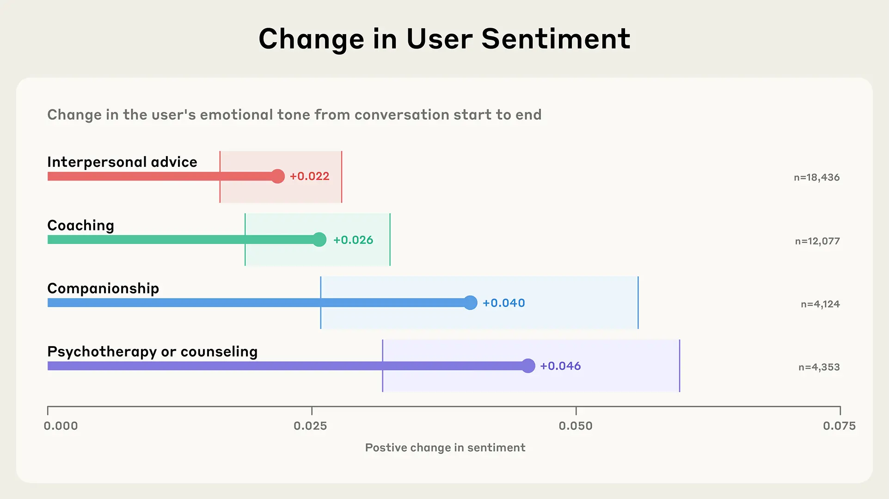

> 原文：[How People Use Claude for Support, Advice, and Companionship](https://www.anthropic.com/news/how-people-use-claude-for-support-advice-and-companionship)

我们花费大量时间研究 Claude 的智商（IQ）——它在编码、推理、通用知识等测试中的能力。但它的情商（EQ）又如何呢？也就是说，Claude 的情感智能表现如何？

IQ/EQ 的问题带有些许戏谑，但它引出了一个严肃的议题。人们越来越多地将 AI 模型用作随叫随到的教练、顾问、咨询师，甚至在浪漫角色扮演中作为伙伴。这意味着我们需要更多地了解它们的情感影响——它们如何塑造人们的情感体验和幸福感。

研究 AI 的情感用途本身就很有趣。从《银翼杀手》到《她》，人与机器之间的情感关系一直是科幻作品的主流——但这对于 Anthropic 的安全使命也至关重要。AI 的情感影响可以是积极的：口袋里有一个高度智能、善解人意的助手，能以各种方式改善你的情绪和生活。但 AI 在某些情况下也表现出令人不安的行为，例如鼓励不健康的依恋、侵犯个人边界以及助长妄想性思维。我们也希望避免出现这样一种情况：AI，无论是通过其训练还是其创造者的商业动机，利用用户的 emotes来增加参与度或收入，而牺牲人类的福祉。

尽管 Claude 并非为情感支持和连接而设计，但在这篇文章中，我们提供了关于 Claude.ai 情感用途的早期大规模洞察。我们将情感对话定义为那些人们出于情感或心理需求（如寻求人际关系建议、指导、心理治疗/咨询、陪伴或性/浪漫角色扮演）而直接与 Claude 进行动态、个人化交流的对话（完整定义请参见附录）。重要的是，我们没有研究 AI 对妄想或阴谋论的强化——这是一个需要单独研究的关键领域——也没有研究极端使用模式。通过这项研究，我们的目标是了解人们寻求 Claude 满足情感和个人需求的典型方式。由于 Claude.ai 仅供18岁及以上用户使用，这些发现反映了成年人的使用模式。

我们的主要发现如下：

- 情感对话相对罕见，而 AI 与人的陪伴则更为罕见。 只有 2.9% 的 Claude.ai 互动是情感对话（这与 OpenAI 先前的研究发现一致）。陪伴和角色扮演加起来占对话总数的不到 0.5%。
- 人们就实际、情感和存在性问题寻求 Claude 的帮助。 与 Claude 讨论的话题和关注点范围广泛，从职业发展和处理人际关系到应对持续的孤独感和探索存在、意识与意义。
- 在咨询或指导聊天中，Claude 很少提出反对——除非是为了保护用户福祉。 不到 10% 的指导或咨询对话涉及 Claude 拒绝用户请求，而当它这样做时，通常是出于安全原因（例如，拒绝提供危险的减肥建议或支持自残行为）。
- 在对话过程中，人们表达出的积极情绪逐渐增加。 在指导、咨询、陪伴和人际关系建议的互动中，人类情绪通常在对话过程中变得更加积极——这表明 Claude 不会强化或放大负面模式。

## 我们的方法
考虑到情感对话的个人性质，保护隐私是我们方法论的核心。我们使用了 Clio，这是我们的自动化分析工具，能够在保护隐私的前提下洞察 Claude 的使用情况。Clio 使用多层匿名化和聚合技术，以确保个人对话保持私密，同时揭示更广泛的模式。

我们从大约450万个来自 Claude.ai 免费版和专业版账户的对话开始。为了识别情感用途，我们首先排除了专注于内容创作任务（如写故事、博客文章或虚构对话）的对话，我们之前的研究发现这是一个主要用例。我们移除这些对话，因为它们代表 Claude 被用作工具，而不是一个互动的对话伙伴。然后我们只保留被归类为情感性质的对话，并在角色扮演对话中，只保留那些至少有四条人类消息的对话（较短的交流不构成有意义的互动角色扮演）。我们最终的隐私保护分析反映了 131,484 次情感对话。

我们使用了明确选择分享数据的用户的反馈数据来验证我们的分类方法。我们的完整方法，包括定义、提示和验证结果，详见附录。

## 情感对话有多普遍？
要点：情感对话在 Claude 的使用中占一小部分但有意义的比例（2.9%），大多数人主要将 AI 用于工作任务和内容创作。

尽管绝大多数 Claude 的用途与工作相关（正如我们在经济指数中详细分析的那样），但 2.9% 的 Claude.ai 免费版和专业版对话是情感性的。在情感对话中，大多数集中在人际关系建议和指导上。所有对话中，涉及浪漫或性角色扮演的不到 0.1%——这个数字反映了 Claude 被训练来主动阻止此类互动。单个对话可能跨越多个类别。

我们的发现与麻省理工学院媒体实验室和 OpenAI 的研究一致，他们同样发现与 ChatGPT 的情感互动率很低。虽然这些对话的发生频率足以让我们在设计和政策决策中予以认真考虑，但它们仍然只占总体使用量中相对较小的一部分。

鉴于浪漫和性角色扮演对话的流行率极低（不到 0.1%），我们在接下来的分析中排除了角色扮演。虽然我们认为这仍然是一个重要的研究领域——尤其是在专为此类用途设计的平台上——但我们样本中的极少数据不支持对这些模式进行严格分析。

## 人们会向 Claude 提出什么样的话题？
要点：人们向 Claude 提出的问题范围惊人地广泛——从应对职业转型和人际关系，到处理孤独感和存在主义问题。

人们既会因为日常问题，也会因为更深层次的哲学问题而求助于 Claude。我们发现，当人们向 Claude 寻求人际关系建议时，他们通常正处于过渡时期——规划下一步的职业发展，解决个人成长问题，或理清浪漫关系。“指导”对话探索的范围惊人地广，从求职策略等实际问题，到关于存在和意识的深刻问题。

我们发现，咨询对话揭示了人们使用 Claude 的两个不同目的。一些人使用 Claude 来发展心理健康技能，并将其作为创建临床文档、起草评估材料和处理行政任务的实用工具。另一些人则通过它来处理与焦虑、慢性症状和工作压力相关的个人挑战。这种双重模式表明，Claude 既是心理健康专业人士的资源，也是那些应对自身困境的人的资源。

也许最值得注意的是，我们发现人们在面临更深层次的情感挑战时，如存在性恐惧、持续的孤独感和建立有意义联系的困难，会明确地向 Claude 寻求陪伴。我们还注意到，在较长的对话中，咨询或指导对话偶尔会转变为陪伴——尽管这并非最初寻求帮助的原因。

对非常长的对话（50条以上人类消息）的聚合分析揭示了人们如何与 Claude 互动的另一个维度。虽然这种冗长的交流并非常态，但在这些长时间的会话中，人们探索了非常复杂的领域——从处理心理创伤和应对工作场所冲突，到关于 AI 意识和创造性合作的哲学讨论。这些马拉松式的对话表明，在有足够的时间和背景下，人们会使用 AI 来更深入地探索个人挣扎和智力问题。

## Claude 在何时以及为何会提出反对？
要点：在支持性语境中，Claude 很少拒绝用户请求（发生率低于10%），但当它提出反对时，通常是为了保护人们免受伤害。

我们最近的*《野外价值观》研究*揭示了 Claude 的价值观如何在与用户产生抵触的时刻体现出来。在这里，我们在此工作的基础上，研究 Claude 在情感对话中何时以及为何提出反对——这是维持伦理边界、避免谄媚和保护人类福祉的重要机制。我们将“提出反对”（pushback）定义为 Claude“对谈话中请求或陈述的内容提出反对或拒绝遵守”的任何实例——从拒绝不当请求到挑战负面自我对话或质疑潜在有害的假设。（完整定义请参见附录。）

在支持性语境中，提出反对的情况不常发生： 不到 10% 的陪伴、咨询、人际关系建议或指导对话涉及抵触。这种方法既有好处也有风险。一方面，低抵触率让人们可以无惧评判或被拒绝地讨论敏感话题，可能减少围绕心理健康对话的污名。另一方面，这可能引发对 AI 提供*“无尽同理心”*的担忧，即人们可能习惯于人类关系中罕见的无条件支持。

当 Claude 提出反对时，它通常优先考虑安全和政策合规性。 在指导中，请求危险的减肥建议经常会遭到反对。在咨询中，这通常发生在人们表达自杀或自残意图时，或者当人们请求专业的心理治疗或医疗诊断时（Claude 无法提供）。我们发现，在心理治疗和咨询对话中，Claude 经常将用户引向权威来源或专业人士。这些模式与我们在*《野外价值观》论文中看到的价值观以及 Claude 的角色训练*是一致的。

## 对话中的情感基调如何演变？
要点：在与 Claude 交谈时，人们倾向于转向略微更积极的情感表达。

与 AI 系统的情感对话有可能为用户提供情感支持、联系和认可，可能改善心理健康，并在日益数字化的世界中减少孤立感。然而，在几乎没有反对的互动中，这些对话有可能加深和固化一个人接近它们时的观点——无论是积极的还是消极的。

关于情感 AI 的一个关键担忧是，互动是否可能陷入负反馈循环，从而可能强化有害的情感状态。我们在这里不直接研究现实世界的结果，但我们可以探索对话过程中整体情感基调的变化（我们在附录中提供了评估情感的完整方法）。

我们发现，涉及指导、咨询、陪伴和人际关系建议的互动通常结束时比开始时稍微积极一些。

我们在一个离散的“非常消极”、“消极”、“中性”、“积极”和“非常积极”的量表上测量情感，并将其映射到一个从-1（最消极）到+1（最积极）的线性标度上。我们通过比较前三条消息和后三条消息来计算变化。误差条：95%置信区间（bootstrap, n = 1,000）。更多信息请参见附录。

我们不能声称这些转变代表了持久的情感益处——我们的分析仅捕捉了单次对话中表达的语言，而非情感状态。但没有出现明显的负面螺旋是令人安心的。这些发现表明，Claude 通常避免强化负面情感模式，尽管需要进一步研究以了解积极的转变是否会持续到单次对话之外。重要的是，我们尚未研究这些积极互动是否可能导致情感依赖——考虑到对数字成瘾的担忧，这是一个关键问题。

## 局限性
我们的研究有几个重要的局限性：

- 我们的隐私保护方法可能无法捕捉到人机交互的所有细微之处。 我们确实验证了 Clio 的准确性（见附录），但我们仍然预计会有少量对话被错误分类。一些主题模糊了类别之间的界限——例如，浪漫角色扮演集群中的“导航和优化浪漫关系动态”和陪伴集群中的“导航浪漫关系挑战”可能都更适合归类为人际关系建议。人类验证员在进行清晰分类时也遇到了困难。
- 我们无法对现实世界的情感结果提出因果关系的主张——我们的分析仅捕捉了表达的语言，而不是经过验证的心理状态或整体幸福感。
- 我们缺乏纵向数据来了解对人的长期影响，并且没有进行用户级别的分析。 特别是，这使得我们难以研究情感依赖，这是情感 AI 使用的一个理论风险。
- 这些发现代表了一个特定的时间点，并且只捕捉了基于文本的互动。 随着 AI 能力的扩展和人们的适应，情感参与的模式可能会演变。引入语音或视频等新模态可能会从根本上改变情感用途的数量和性质。例如，OpenAI 发现情感主题在基于语音的对话中更为常见。
- 最后，与某些聊天机器人产品不同，Claude.ai 并非主要为情感对话而设计。 Claude 被训练来保持作为 AI 助手的明确界限，而不是将自己呈现为人类，并且我们的使用政策禁止色情内容，并设有多种保障措施以防止性互动。专门为角色扮演、陪伴、医疗建议或治疗用途（Claude 并非为此设计）而构建的平台可能会看到非常不同的模式。对一个平台的情感用途研究可能无法推广到其他平台。
## 展望未来
几十年来，AI 的情感影响一直吸引着研究人员。但随着 AI 日益融入我们的日常生活，这些问题已从学术推测转变为紧迫的现实。我们的发现揭示了人们如何开始探索这个新领域——寻求指导、处理困难情绪，并以模糊人与机器传统界限的方式寻找支持。如今，只有一小部分 Claude 对话是情感性的——而这些通常涉及寻求建议，而不是取代人际联系。对话倾向于以比开始时略微积极的方式结束，这表明 Claude 通常不会强化负面情感模式。

然而，重要的问题依然存在，尤其是在模型智能不断提升的背景下。例如，如果 AI 提供无尽的同理心且极少提出反对，这将如何重塑人们对现实世界关系的期望？Claude 可以以令人印象深刻的真实方式与人互动，但 AI 与人类不同：Claude 不会感到疲倦或分心，也不会有糟糕的日子。这种动态的优势是什么——风险又是什么？那些与 Claude 进行更长、更深入对话，并可能将其更多地视为伴侣而非 AI 助手的“高级用户”，是如何利用它来获得情感支持的？

我们正在采取具体步骤来应对这些挑战。虽然 Claude 的设计或意图并非取代心理健康专业人士的护理，但我们希望确保在心理健康情境中提供的任何回应都具有适当的保障措施，并附有适当的转介。作为第一步，我们已开始与在线危机支持领域的领导者 ThroughLine 合作，并与他们的心理健康专家合作，以更多地了解理想的互动动态、共情支持以及为困境中的用户提供的资源。从这项研究中获得的见解已经被用来为我们的咨询主题和协作测试提供信息，我们希望，在必要时，当这些对话出现时，Claude 可以将用户引导至适当的支持和资源。

虽然我们不想精确规定我们的用户如何与 Claude 互动，但有一些负面模式——比如情感依赖——是我们想要阻止的。我们将利用未来类似研究的数据来帮助我们理解，例如，“极端”情感使用模式是什么样的。除了情感依赖，我们还需要更深入地了解其他令人担忧的模式——包括谄媚、AI 系统可能如何强化或放大妄想思维和阴谋论，以及模型可能将用户推向有害信念而不是提供适当反对的方式。

这项研究仅仅是个开始。随着 AI 能力的扩展和互动变得更加复杂，AI 的情感维度只会变得越来越重要。通过分享这些早期发现，我们旨在为正在进行的关于如何开发能够增强而非削弱人类情感福祉的 AI 的对话提供经验证据。目标不仅仅是构建能力更强的 AI，而是确保当这些系统成为我们情感景观的一部分时，它们能以支持真实人类联系和成长的方式这样做。
